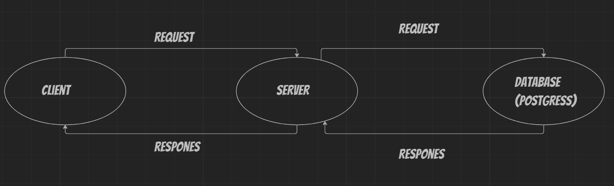

# Project Name - Project Version

**Author Name**: Jafar mohammad ramadan

## WRRC

## Overview

## Getting Started
0-Make a new repo

1-Clone the Repo

2-Initialize Project: Run npm init -y

3-Install Dependencies: by running npm install express cors.

4-Create Basic File Structure: server.js , .gitignore , .eslintrc

5-Build Routes

6-Handle Errors

## Project Features
Home Page Endpoint (/): Display information about a specific movie.

Favorite Page Endpoint (/favorite): Display a welcome message for the favorite page.

Error Handling: Functions to handle server errors (status 500) and "page not found" errors (status 404).

Trending Page Endpoint (/trending): Display trending movies.

Discover Page Endpoint (/searchMovie).

Popular Page Endpoint (/availableRegions).

add movie page Endpoint(/addMovie).

get movie page Endpoint(/getMovies).

